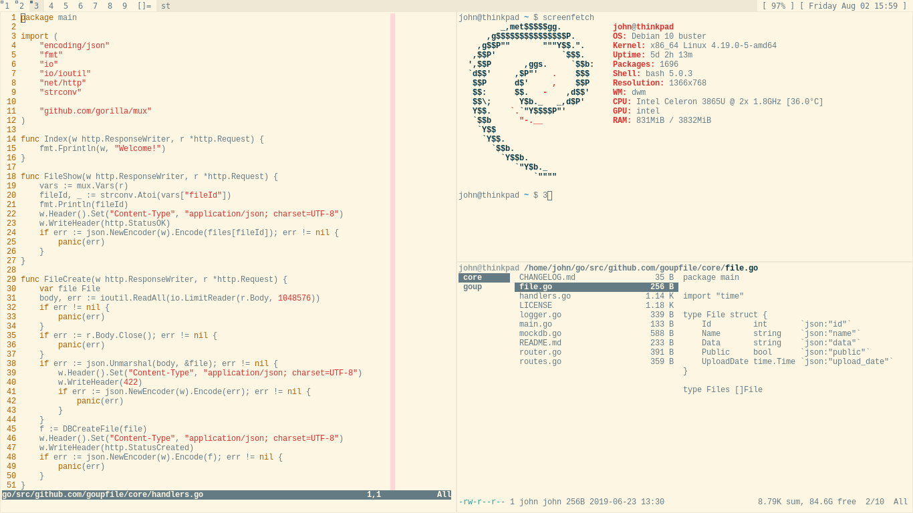
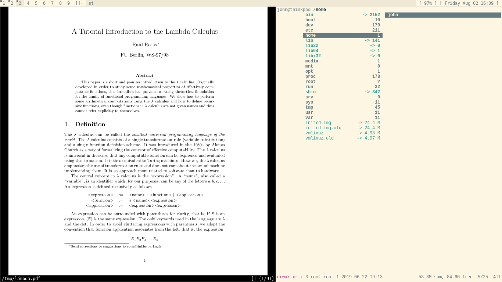

# dotfiles

I use the [Solarized](https://ethanschoonover.com/solarized/) color scheme for
nearly everything—it's wonderful.

**Currently** Debian / Bash / Vim / [dwm](https://dwm.suckless.org/) / [st](https://st.suckless.org/)

**Soon to be** Arch / Zsh / Neovim / [dwm](https://dwm.suckless.org/) / [st](https://st.suckless.org/)

## Goals

- It must be **lightweight** since my current laptop isn't the best, and I tend
  to keep my devices for a long time.
- It must **maximize my workflow** without getting in the way.
- It must **use screen space efficiently** since I love 13.3" laptops and don't
  usually use a monitor, instead keeping the laptop on a stand with keyboard and
  mouse.

> Tools should be ambient. It disappears and flows through your actions. You
> should never need it because it's always at your hands. You should never
> ignore it because it's never in your way. —[Hunor Karamán](https://hex22.org/wiki/manifesto/)

## Non-goals

- It should not be worthy of a [photo shoot](screenshots/want.png).
- It should not be easy to customize, since I've gone down this rabbit hole before, and now
  I'd rather just have something that fits my workflow like a glove and gives me
  the freedom to focus on actual work.

## Screenshots

(to be updated soon)

