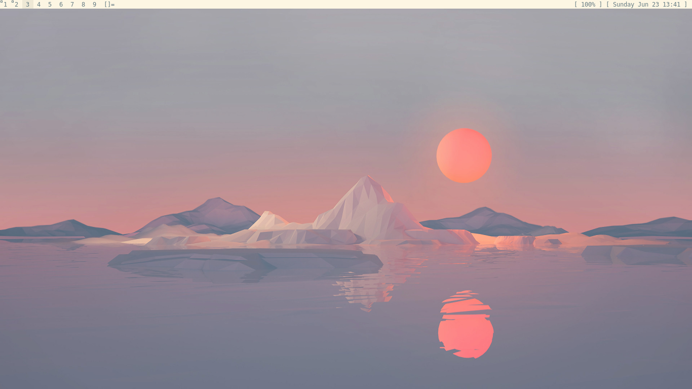
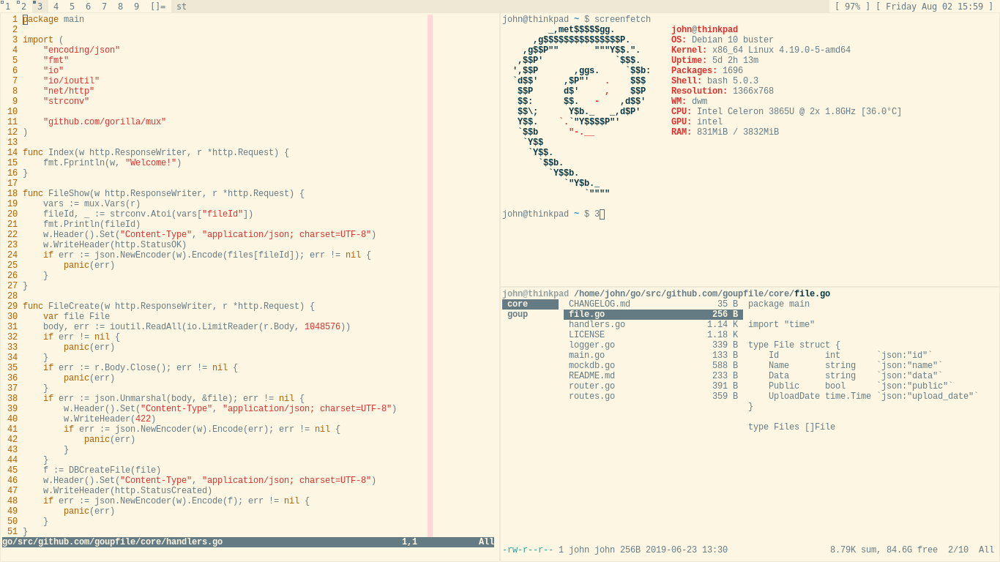
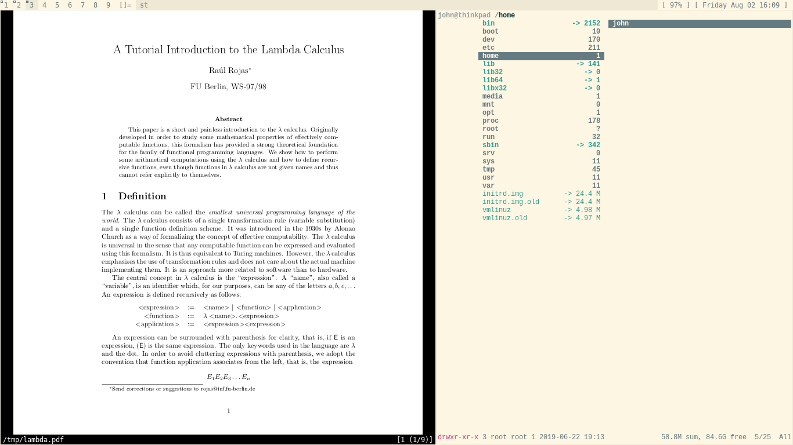

# dotfiles

I use the [Solarized](https://ethanschoonover.com/solarized/) color scheme for
nearly everything—it's wonderful.

Current:

 - Debian
 - [dwm](https://dwm.suckless.org/)
 - [st](https://st.suckless.org/)
 - Bash
 - Vim

Soon to be:

- Arch
- [dwm](https://dwm.suckless.org/)
- [st](https://st.suckless.org/)
 - Zsh
 - Neovim

## Why this setup works well for me

…and why it might not work for you.

My standard desk setup is a 13.3" laptop on a stand, with keyboard and mouse.
Since I don't typically use an external monitor, I have to make the most of the
screen space I have. That's the driving reason behind a lot of the visual
configuration. With dwm's `alt+b` I can even hide the status bar as long I
remember what applications are in which workspace. So while it doesn't look
pretty, its utility is unmatched for my workflow.

It's also ridiculously lightweight.

> Tools should be ambient. It disappears and flows through your actions. You
> should never need it because it's always at your hands. You should never
> ignore it because it's never in your way. —[Hunor Karamán](https://hex22.org/wiki/manifesto/)

