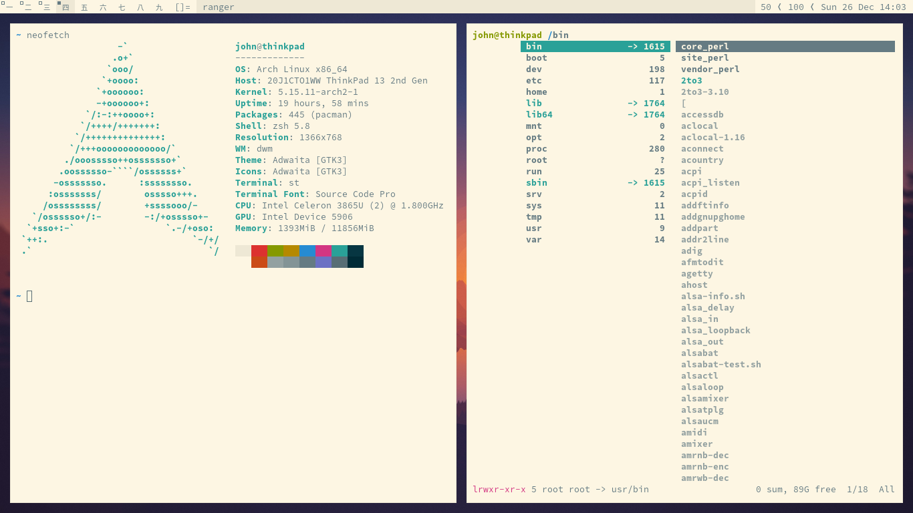

# dotfiles

I use the [Solarized](https://ethanschoonover.com/solarized/) color scheme for
everything—it's wonderful.

ThinkPad 13 (2017): Arch Linux, zsh, nvim, [dwm](https://dwm.suckless.org/),
[st](https://st.suckless.org/)

MacBook Air (2020): macOS, zsh, nvim, Amethyst, iTerm2

## Goals

My setup is carefully chosen.

- It's **lightweight**, digitally, since I tend to keep my devices for a
  long time, and physically, since I travel often.
- It **maximizes workflow** without getting in the way.
- It **doesn't change often**, because I value high impact work over tinkering all day.
- It **uses screen space efficiently** since I have small laptops and don't
  usually use a monitor, instead keeping the laptop on a stand with keyboard
  and mouse.

> Tools should be ambient. It disappears and flows through your actions. You
> should never need it because it's always at your hands. You should never
> ignore it because it's never in your way. —[Hunor Karamán](https://hex22.org/wiki/manifesto/)

## dwm

For my Linux machine, I use a tiling window manager called dwm. It's mostly
stock except for the following patches:

- [fullgaps](https://dwm.suckless.org/patches/fullgaps/) - I added a shortcut to reset the gaps.
- [solarized](https://github.com/johnjago/dotfiles/blob/main/dwm/patches/dwm-solarized-6.2.diff) - This is my own patch that changes a few colors, including dmenu colors, to match Solarized Light.
- Font is set to Source Code Pro (though I could probably do this with fontconfig)
- The tag numbers are in CJK characters
- Firefox doesn't stick to the 9th tag
- The default window split is 50/50 instead of 55/45
- Monocle layout is second instead of third
- Keyboard shortcuts for changing brightness ("Windows" key + up/down) and
  audio (alt + up/down) without having to reach for the multimedia keys
- Keyboard shortcut for locking the screen with slock ("Windows" key + l)

## Screenshots

### Linux

The typeface in the terminal, status bar, and code editor is Source Code Pro.

I don't typically use gaps if not using an external monitor. I just did it for
the screenshots.

### Mac

