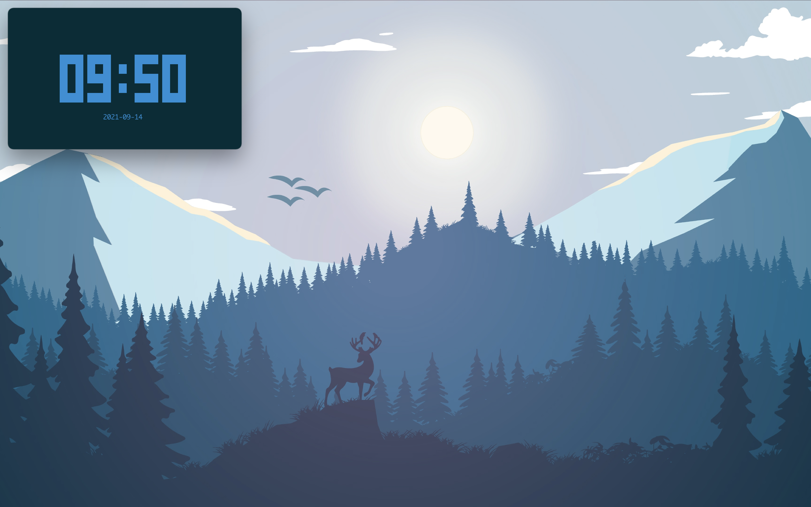

# dotfiles

I use the [Solarized](https://ethanschoonover.com/solarized/) color scheme for
everything—it's wonderful.

ThinkPad 13: Debian (soon to be Arch), zsh, nvim, [dwm](https://dwm.suckless.org/), [st](https://st.suckless.org/)

MacBook Air (2020): macOS, zsh, nvim, Amethyst, iTerm2

## Goals

My tools are carefully chosen.

- They must be **lightweight** since my current laptop(s) aren't the best, and
- I tend to keep my devices for a long time.
- They must **maximize workflow** without getting in the way.
- They must **use screen space efficiently** since I have small laptops and
  don't usually use a monitor, instead keeping the laptop on a stand with
  keyboard and mouse.

> Tools should be ambient. It disappears and flows through your actions. You
> should never need it because it's always at your hands. You should never
> ignore it because it's never in your way. —[Hunor Karamán](https://hex22.org/wiki/manifesto/)

## Non-goals

- It should not be worthy of a photo shoot.
- It should not be easy to customize, since I've gone down this rabbit hole
  before, and now I'd rather just have something that fits my workflow and
  gives me the freedom to focus on actual work.

## Screenshots

### Linux

The typeface in the terminal, status bar, and code editor is Source Code Pro.

Sorry, I had a lot of stuff open while taking these.

I don't typically use gaps if not using an external monitor. I just did it for
the screenshots.

### Mac

